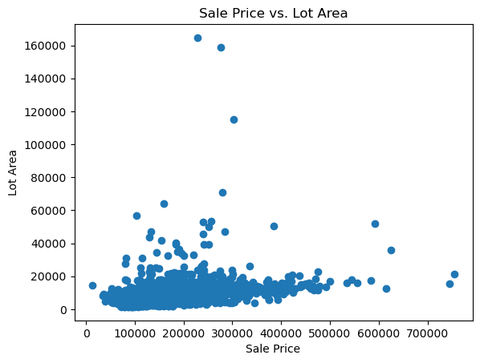
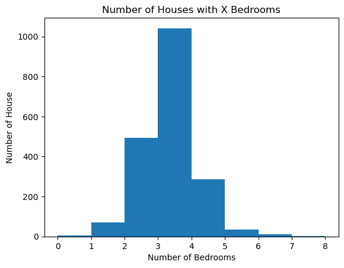

## Part 1: EDA

_Insert cells as needed below to write a short EDA/data section that summarizes the data for someone who has never opened it before._ 
- Answer essential questions about the dataset (observation units, time period, sample size, many of the questions above) 
- Note any issues you have with the data (variable X has problem Y that needs to get addressed before using it in regressions or a prediction model because Z)
- Present any visual results you think are interesting or important


```python
import pandas as pd
from statsmodels.formula.api import ols as sm_ols
import numpy as np
import seaborn as sns
from statsmodels.iolib.summary2 import summary_col
import matplotlib.pyplot as plt
import seaborn as sns
```


```python
# Data

house_data = pd.read_csv('input_data2/housing_train.csv')
```

# Essential Info

- The unit of observation for this dataset is a house.
- Oldest house was built in 1872, newest house built in 2008
- Covers sales of houses during the years 2006-2008
- Data is composed of both continuous, discrete, and categorical variables
- Covers everything from zoning to lot size
- Some data, such as utilities, won't be useful for our analysis
- If a house doesn't have something, the data is either left blank or filled in with either None/0.0
- TA/av means average for a given variable

# Issues with Data

- Some data will have to be converted so that python understands it (ex: dates)
- Some variables have different rating scales


```python
# Visuals

plt.scatter(house_data['v_SalePrice'], house_data['v_Lot_Area'])
plt.xlabel('Sale Price')
plt.ylabel('Lot Area')
plt.title('Sale Price vs. Lot Area')
plt.show()
```


    

    


```python
plt.hist(house_data['v_Bedroom_AbvGr'], bins=8)

plt.xlabel('Number of Bedrooms')
plt.ylabel('Number of House')
plt.title('Number of Houses with X Bedrooms')
plt.show()
```


    

    


## Part 2: Running Regressions

**Run these regressions on the RAW data, even if you found data issues that you think should be addressed.**

_Insert cells as needed below to run these regressions. Note that $i$ is indexing a given house, and $t$ indexes the year of sale._ 

1. $\text{Sale Price}_{i,t} = \alpha + \beta_1 * \text{v_Lot_Area}$
1. $\text{Sale Price}_{i,t} = \alpha + \beta_1 * log(\text{v_Lot_Area})$
1. $log(\text{Sale Price}_{i,t}) = \alpha + \beta_1 * \text{v_Lot_Area}$
1. $log(\text{Sale Price}_{i,t}) = \alpha + \beta_1 * log(\text{v_Lot_Area})$
1. $log(\text{Sale Price}_{i,t}) = \alpha + \beta_1 * \text{v_Yr_Sold}$
1. $log(\text{Sale Price}_{i,t}) = \alpha + \beta_1 * (\text{v_Yr_Sold==2007})+ \beta_2 * (\text{v_Yr_Sold==2008})$
1. Choose your own adventure: Pick any five variables from the dataset that you think will generate good R2. Use them in a regression of $log(\text{Sale Price}_{i,t})$ 
    - Tip: You can transform/create these five variables however you want, even if it creates extra variables. For example: I'd count Model 6 above as only using one variable: `v_Yr_Sold`.
    - I got an R2 of 0.877 with just "5" variables. How close can you get? I won't be shocked if someone beats that!
    

**Bonus formatting trick:** Instead of reporting all regressions separately, report all seven regressions in a _single_ table using `summary_col`.


```python
# Create Variables

house_data = (house_data.assign(l_Lot_Area = np.log(house_data['v_Lot_Area']), l_SalePrice = np.log(house_data['v_SalePrice'])))

house_data['v_Yr_Sold_20078'] = (house_data['v_Yr_Sold'].isin([2007, 2008])).astype(int)
```


```python
# Run Regressions
spla = sm_ols('v_SalePrice ~  v_Lot_Area', data=house_data).fit()

splogla = sm_ols('v_SalePrice ~ l_Lot_Area', data=house_data).fit()

logspla = sm_ols('l_SalePrice ~ v_Lot_Area', data=house_data).fit()

logsplogla = sm_ols('l_SalePrice ~ l_Lot_Area', data = house_data).fit()

logspyrsold = sm_ols('l_SalePrice ~ v_Yr_Sold', data = house_data).fit()

logspyrsold78 = sm_ols('l_SalePrice ~ v_Yr_Sold_20078', data = house_data).fit()

logspcust = sm_ols('l_SalePrice ~ v_Overall_Qual + v_Full_Bath + v_TotRms_AbvGrd + v_Garage_Cars + v_Overall_Cond', data = house_data).fit()
```


```python
info_dict={'R-squared' : lambda x: f"{x.rsquared:.2f}",
            'Adj R-squared' : lambda x: f"{x.rsquared_adj:.2f}",
            'No. observations' : lambda x: f"{int(x.nobs):d}"}

print(summary_col(results=[spla, splogla, logspla, logsplogla, logspyrsold, logspyrsold78, logspcust],
                  float_format='%0.2f',
                  stars = True,
                  model_names=['1','2','3(log)','4(log)','5(log)','6(log)','7(log)','8'], info_dict = info_dict))
```

    
    ======================================================================================
                          1             2        3(log)   4(log)  5(log)  6(log)   7(log) 
    --------------------------------------------------------------------------------------
    Intercept        154789.55*** -327915.80*** 11.89*** 9.41*** 22.29   12.02*** 10.26***
                     (2911.59)    (30221.35)    (0.01)   (0.15)  (22.94) (0.02)   (0.03)  
    R-squared        0.07         0.13          0.06     0.13    0.00    0.00     0.77    
    R-squared Adj.   0.07         0.13          0.06     0.13    -0.00   -0.00    0.77    
    l_Lot_Area                    56028.17***            0.29***                          
                                  (3315.14)              (0.02)                           
    v_Full_Bath                                                                   0.08*** 
                                                                                  (0.01)  
    v_Garage_Cars                                                                 0.13*** 
                                                                                  (0.01)  
    v_Lot_Area       2.65***                    0.00***                                   
                     (0.23)                     (0.00)                                    
    v_Overall_Cond                                                                0.03*** 
                                                                                  (0.00)  
    v_Overall_Qual                                                                0.17*** 
                                                                                  (0.00)  
    v_TotRms_AbvGrd                                                               0.04*** 
                                                                                  (0.00)  
    v_Yr_Sold                                                    -0.01                    
                                                                 (0.01)                   
    v_Yr_Sold_20078                                                      0.01             
                                                                         (0.02)           
    R-squared        0.07         0.13          0.06     0.13    0.00    0.00     0.77    
    Adj R-squared    0.07         0.13          0.06     0.13    -0.00   -0.00    0.77    
    No. observations 1941         1941          1941     1941    1941    1941     1940    
    ======================================================================================
    Standard errors in parentheses.
    * p<.1, ** p<.05, ***p<.01


## Part 3: Regression interpretation

_Insert cells as needed below to answer these questions. Note that $i$ is indexing a given house, and $t$ indexes the year of sale._ 

1. If you didn't use the `summary_col` trick, list $\beta_1$ for Models 1-6 to make it easier on your graders.
1. Interpret $\beta_1$ in Model 2. 
1. Interpret $\beta_1$ in Model 3. 
    - HINT: You might need to print out more decimal places. Show at least 2 non-zero digits. 
1. Of models 1-4, which do you think best explains the data and why?
1. Interpret $\beta_1$ In Model 5
1. Interpret $\alpha$ in Model 6
1. Interpret $\beta_1$ in Model 6
1. Why is the R2 of Model 6 higher than the R2 of Model 5?
1. What variables did you include in Model 7?
1. What is the R2 of your Model 7?
1. Speculate (not graded): Could you use the specification of Model 6 in a predictive regression? 
1. Speculate (not graded): Could you use the specification of Model 5 in a predictive regression? 


# Interpretation Answers

1. I used the summary_col trick.
2. A change of 2.65 in lot area means a change of 2911.59 in sale price assuming intercept is 154789.550207. 
3. A change of 0.000013 in lot area means a change of 0.01 in sale price assuming intercept is 11.894073.
4. I think that model 1 best explains the area because it has an intercept that makes sense and an increase in lot area means an increase in price. 
5. Houses sold earlier in time sell for a slightly higher price. 
6. This alpha doesn't make sense to me because I would expect alpha to rise when only selecting data from the years 2007 and 2008. 
7. A house sold in 2008 sells for slightly more than a house in 2007. 
8. I think that R2 is higher in model 6 than it is in model 5 because housing prices continued to increase during that time period and by excluding the year 2006 in our model we should expect to get higher house prices from only 2007 and 2008. 
9. v_Overall_Qual + v_Full_Bath + v_TotRms_AbvGrd + v_Garage_Cars + v_Overall_Cond
10. 0.77
11. No because you are choosing to exclude data from the year 2006 which is a vital part of the analysis when examining sale price. 
12. Yes because this includes data for all the years available in the given data set. 
