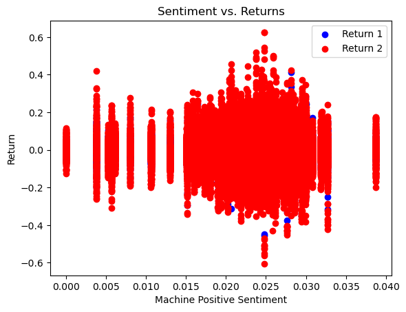
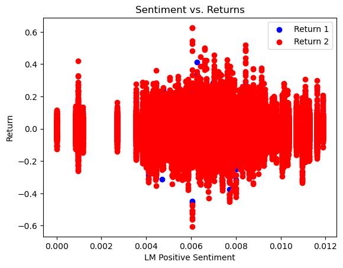
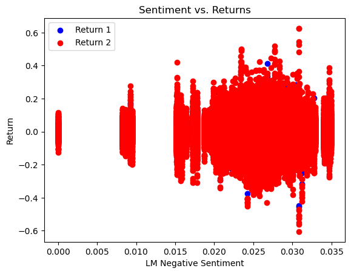
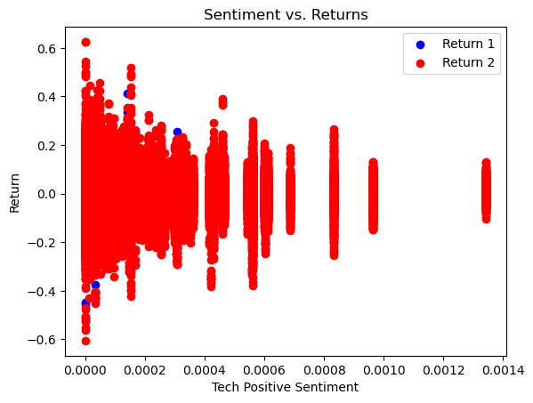
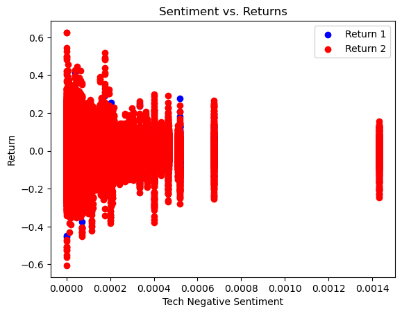
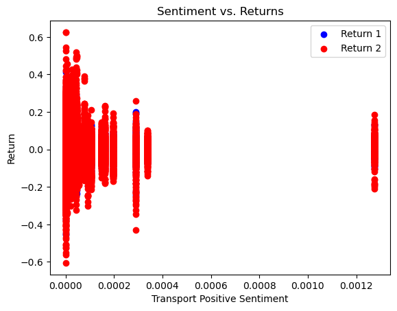
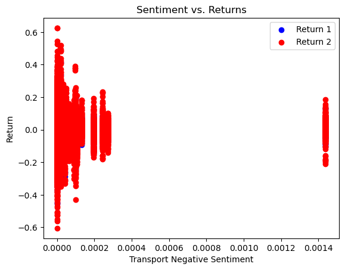
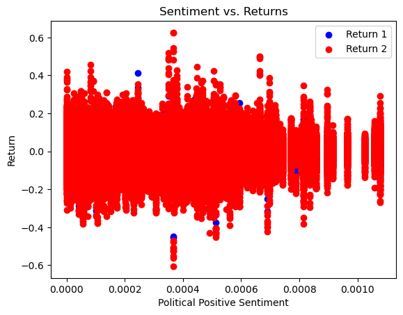
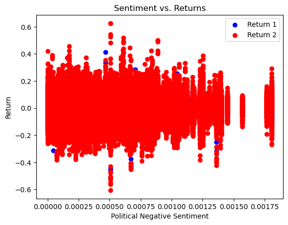

# Report File Summary

It is well known that stock prices have a strong correlation with the release of financial results from their respective companies. When firms release financial documents with strong numbers and a positive outlook, stock prices are almost certain to climb while the opposite can be observed when a firm releases financial documents with weak numbers and a bleak outlook. Knowing this, I wanted to examine if a correlation could be observed between the use of certain verbiage in a company's 10k and the returns for that company's stock over two different periods. Using four datasets that had compiled words deemed to either a positive or negative sentiment, I was able to observe how these words may have played a role in how a stock traded in the following days. I also compiled categories of words that I believed could have a positive/negative effect on a stock based on whether these words were surrounded by positive or negative words. The culmination of these efforts resulted in this study which helps to provide insight into the claims presented here. 

# Data Section

- What’s the sample?
The sample is the S&P 500 10ks that we downloaded from the SEC.

- How are the return variables built and modified? (Mechanical description.) Aim for rigor and do not skip steps. You can include text and formulas here.


- How are the sentiment variables are built and modified? (Mechanical description.) Aim for rigor and do not skip steps. You can include text and formulas here.

- Why did you choose the three topics you did for the “contextual sentiment” measures?
I chose the three topics that I did because they are all of pivotal importance to the success of a company especially in recent years. Technology is the backbone of any business, transportation has become an issue over the past few years due to supply chain issues, and politics determine how a business is able to operate. I believe that all of these topics are important and can help give better insight into the performance of a business when compared against the positive and negative word lists. 

- Show and discuss summary stats of your final analysis sample

- Do your “contextual sentiment” measures pass some basic smell tests?

- Smell tests: Is something fishy? (What you look for depends on the setting.)

- Do you have variation in the measures (i.e a variable is not all the same value)?
Yes. I did not get the same values for all variables. 

- Are industries the industries you expect talking about your subject positively or negatively?

- Are there any caveats about the sample and/or data? If so, mention them and briefly discuss possible issues they raise with the analysis.
Possible issues with the data include python placing incorrect 10ks in another company's folder (ex: T which is AT&T has the 10k for Guggenheim). This is an issue that can sometimes occur when a company has a short ticker. I also had an issue mapping the returns to be around the filing date of the 10k which can lead to some confusing analysis as my code provided returns for all dates available. 


```python
# Results

import pandas as pd
import numpy as np

sp500_returns = pd.read_csv('output/analysis_sample.csv')

sentiment_data = pd.DataFrame(sp500_returns, columns=['Machine Positive', 'Machine Negative', 'LM Positive', 'LM Negative', 'Tech Positive', 'Tech Negative', 'Transport Positive', 'Transport Negative', 'Political Positive', 'Political Negative'])
return_data = pd.DataFrame(sp500_returns, columns=['T to T2', 'T3 to T10'])

compare_data = pd.concat([sentiment_data, return_data], axis=1)

correlation_matrix = compare_data.corr()

print(correlation_matrix)
```

                        Machine Positive  Machine Negative  LM Positive  \
    Machine Positive            1.000000          0.509874     0.416132   
    Machine Negative            0.509874          1.000000     0.321908   
    LM Positive                 0.416132          0.321908     1.000000   
    LM Negative                 0.509874          1.000000     0.321908   
    Tech Positive               0.168184          0.024242     0.138873   
    Tech Negative               0.125064          0.022830     0.088169   
    Transport Positive          0.038292         -0.032549    -0.061865   
    Transport Negative          0.019733         -0.022403    -0.077491   
    Political Positive          0.414051          0.351244     0.323330   
    Political Negative          0.340278          0.404150     0.324498   
    T to T2                    -0.002226         -0.003644     0.000818   
    T3 to T10                  -0.005022         -0.008808     0.003494   
    
                        LM Negative  Tech Positive  Tech Negative  \
    Machine Positive       0.509874       0.168184       0.125064   
    Machine Negative       1.000000       0.024242       0.022830   
    LM Positive            0.321908       0.138873       0.088169   
    LM Negative            1.000000       0.024242       0.022830   
    Tech Positive          0.024242       1.000000       0.711531   
    Tech Negative          0.022830       0.711531       1.000000   
    Transport Positive    -0.032549       0.000075      -0.020560   
    Transport Negative    -0.022403      -0.011849      -0.030476   
    Political Positive     0.351244       0.126924       0.151280   
    Political Negative     0.404150       0.137949       0.135394   
    T to T2               -0.003644      -0.000508      -0.001788   
    T3 to T10             -0.008808      -0.001321      -0.003770   
    
                        Transport Positive  Transport Negative  \
    Machine Positive              0.038292            0.019733   
    Machine Negative             -0.032549           -0.022403   
    LM Positive                  -0.061865           -0.077491   
    LM Negative                  -0.032549           -0.022403   
    Tech Positive                 0.000075           -0.011849   
    Tech Negative                -0.020560           -0.030476   
    Transport Positive            1.000000            0.969457   
    Transport Negative            0.969457            1.000000   
    Political Positive           -0.010169           -0.022139   
    Political Negative           -0.028107           -0.027798   
    T to T2                       0.002887            0.002871   
    T3 to T10                     0.007170            0.006972   
    
                        Political Positive  Political Negative   T to T2  \
    Machine Positive              0.414051            0.340278 -0.002226   
    Machine Negative              0.351244            0.404150 -0.003644   
    LM Positive                   0.323330            0.324498  0.000818   
    LM Negative                   0.351244            0.404150 -0.003644   
    Tech Positive                 0.126924            0.137949 -0.000508   
    Tech Negative                 0.151280            0.135394 -0.001788   
    Transport Positive           -0.010169           -0.028107  0.002887   
    Transport Negative           -0.022139           -0.027798  0.002871   
    Political Positive            1.000000            0.865722  0.004907   
    Political Negative            0.865722            1.000000  0.002464   
    T to T2                       0.004907            0.002464  1.000000   
    T3 to T10                     0.012294            0.006248  0.426301   
    
                        T3 to T10  
    Machine Positive    -0.005022  
    Machine Negative    -0.008808  
    LM Positive          0.003494  
    LM Negative         -0.008808  
    Tech Positive       -0.001321  
    Tech Negative       -0.003770  
    Transport Positive   0.007170  
    Transport Negative   0.006972  
    Political Positive   0.012294  
    Political Negative   0.006248  
    T to T2              0.426301  
    T3 to T10            1.000000  


    /var/folders/pg/bf5nt0ds0nn6hp_6dwbgb1wc0000gn/T/ipykernel_20276/528764578.py:6: DtypeWarning: Columns (6) have mixed types. Specify dtype option on import or set low_memory=False.
      sp500_returns = pd.read_csv('output/analysis_sample.csv')


```python
import pandas as pd
import numpy as np
import matplotlib.pyplot as plt

mac_pos_data = pd.DataFrame(sp500_returns, columns=['Machine Positive'])
return_data = pd.DataFrame(sp500_returns, columns=['T to T2', 'T3 to T10'])

mac_pos_graph = pd.concat([mac_pos_data, return_data], axis=1)

# Create scatterplot
plt.scatter(mac_pos_graph['Machine Positive'], mac_pos_graph['T to T2'], color='blue', label='Return 1')
plt.scatter(mac_pos_graph['Machine Positive'], mac_pos_graph['T3 to T10'], color='red', label='Return 2')
plt.xlabel('Machine Positive Sentiment')
plt.ylabel('Return')
plt.title('Sentiment vs. Returns')
plt.legend()
plt.show()
```


    

    


```python
mac_neg_data = pd.DataFrame(sp500_returns, columns=['Machine Negative'])
return_data = pd.DataFrame(sp500_returns, columns=['T to T2', 'T3 to T10'])

mac_neg_graph = pd.concat([mac_neg_data, return_data], axis=1)

# Create scatterplot
plt.scatter(mac_neg_graph['Machine Negative'], mac_neg_graph['T to T2'], color='blue', label='Return 1')
plt.scatter(mac_neg_graph['Machine Negative'], mac_neg_graph['T3 to T10'], color='red', label='Return 2')
plt.xlabel('Machine Negative Sentiment')
plt.ylabel('Return')
plt.title('Sentiment vs. Returns')
plt.legend()
plt.show()
```


    

    


```python
lm_pos_data = pd.DataFrame(sp500_returns, columns=['LM Positive'])
return_data = pd.DataFrame(sp500_returns, columns=['T to T2', 'T3 to T10'])

lm_pos_graph = pd.concat([lm_pos_data, return_data], axis=1)

# Create scatterplot
plt.scatter(lm_pos_graph['LM Positive'], lm_pos_graph['T to T2'], color='blue', label='Return 1')
plt.scatter(lm_pos_graph['LM Positive'], lm_pos_graph['T3 to T10'], color='red', label='Return 2')
plt.xlabel('LM Positive Sentiment')
plt.ylabel('Return')
plt.title('Sentiment vs. Returns')
plt.legend()
plt.show()
```


    

    


```python
lm_neg_data = pd.DataFrame(sp500_returns, columns=['LM Negative'])
return_data = pd.DataFrame(sp500_returns, columns=['T to T2', 'T3 to T10'])

lm_neg_graph = pd.concat([lm_neg_data, return_data], axis=1)

# Create scatterplot
plt.scatter(lm_neg_graph['LM Negative'], lm_neg_graph['T to T2'], color='blue', label='Return 1')
plt.scatter(lm_neg_graph['LM Negative'], lm_neg_graph['T3 to T10'], color='red', label='Return 2')
plt.xlabel('LM Negative Sentiment')
plt.ylabel('Return')
plt.title('Sentiment vs. Returns')
plt.legend()
plt.show()
```


    

    


```python
tech_pos_data = pd.DataFrame(sp500_returns, columns=['Tech Positive'])
return_data = pd.DataFrame(sp500_returns, columns=['T to T2', 'T3 to T10'])

tech_pos_graph = pd.concat([tech_pos_data, return_data], axis=1)

# Create scatterplot
plt.scatter(tech_pos_graph['Tech Positive'], tech_pos_graph['T to T2'], color='blue', label='Return 1')
plt.scatter(tech_pos_graph['Tech Positive'], tech_pos_graph['T3 to T10'], color='red', label='Return 2')
plt.xlabel('Tech Positive Sentiment')
plt.ylabel('Return')
plt.title('Sentiment vs. Returns')
plt.legend()
plt.show()
```


    

    


```python
tech_neg_data = pd.DataFrame(sp500_returns, columns=['Tech Negative'])
return_data = pd.DataFrame(sp500_returns, columns=['T to T2', 'T3 to T10'])

tech_neg_graph = pd.concat([tech_neg_data, return_data], axis=1)

# Create scatterplot
plt.scatter(tech_neg_graph['Tech Negative'], tech_neg_graph['T to T2'], color='blue', label='Return 1')
plt.scatter(tech_neg_graph['Tech Negative'], tech_neg_graph['T3 to T10'], color='red', label='Return 2')
plt.xlabel('Tech Negative Sentiment')
plt.ylabel('Return')
plt.title('Sentiment vs. Returns')
plt.legend()
plt.show()
```


    

    


```python
transport_pos_data = pd.DataFrame(sp500_returns, columns=['Transport Positive'])
return_data = pd.DataFrame(sp500_returns, columns=['T to T2', 'T3 to T10'])

transport_pos_graph = pd.concat([transport_pos_data, return_data], axis=1)

# Create scatterplot
plt.scatter(transport_pos_graph['Transport Positive'], transport_pos_graph['T to T2'], color='blue', label='Return 1')
plt.scatter(transport_pos_graph['Transport Positive'], transport_pos_graph['T3 to T10'], color='red', label='Return 2')
plt.xlabel('Transport Positive Sentiment')
plt.ylabel('Return')
plt.title('Sentiment vs. Returns')
plt.legend()
plt.show()
```


    

    


```python
transport_neg_data = pd.DataFrame(sp500_returns, columns=['Transport Negative'])
return_data = pd.DataFrame(sp500_returns, columns=['T to T2', 'T3 to T10'])

transport_neg_graph = pd.concat([transport_neg_data, return_data], axis=1)

# Create scatterplot
plt.scatter(transport_neg_graph['Transport Negative'], transport_neg_graph['T to T2'], color='blue', label='Return 1')
plt.scatter(transport_neg_graph['Transport Negative'], transport_neg_graph['T3 to T10'], color='red', label='Return 2')
plt.xlabel('Transport Negative Sentiment')
plt.ylabel('Return')
plt.title('Sentiment vs. Returns')
plt.legend()
plt.show()
```


    

    


```python
political_pos_data = pd.DataFrame(sp500_returns, columns=['Political Positive'])
return_data = pd.DataFrame(sp500_returns, columns=['T to T2', 'T3 to T10'])

political_pos_graph = pd.concat([political_pos_data, return_data], axis=1)

# Create scatterplot
plt.scatter(political_pos_graph['Political Positive'], political_pos_graph['T to T2'], color='blue', label='Return 1')
plt.scatter(political_pos_graph['Political Positive'], political_pos_graph['T3 to T10'], color='red', label='Return 2')
plt.xlabel('Political Positive Sentiment')
plt.ylabel('Return')
plt.title('Sentiment vs. Returns')
plt.legend()
plt.show()
```


    

    


```python
political_neg_data = pd.DataFrame(sp500_returns, columns=['Political Negative'])
return_data = pd.DataFrame(sp500_returns, columns=['T to T2', 'T3 to T10'])

# Concatenate sentiment and return data into one dataframe
political_neg_graph = pd.concat([political_neg_data, return_data], axis=1)

# Create scatterplot
plt.scatter(political_neg_graph['Political Negative'], political_neg_graph['T to T2'], color='blue', label='Return 1')
plt.scatter(political_neg_graph['Political Negative'], political_neg_graph['T3 to T10'], color='red', label='Return 2')
plt.xlabel('Political Negative Sentiment')
plt.ylabel('Return')
plt.title('Sentiment vs. Returns')
plt.legend()
plt.show()
```


    

    

